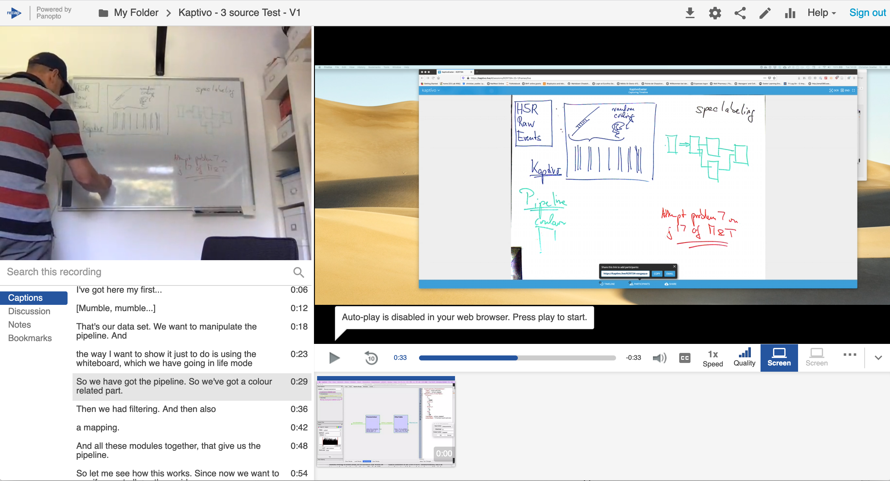

## Using Recap (Panopto) with the Kaptivo digital whiteboard source

#### Caveat - I have no connection with the manufacturer, I just like the general idea and had the opportunity to test the hardware + software

I noticed that in many of my lecture recordings the whiteboard is either poorly legible or not visible at all. This can be greatly improved by use of the Kaptivo Live Whiteboard Sharing technology that I was recently able to trial.

A small recap recording demonstrates the use of [Kaptivo](https://kaptivo.com/education/) and its utility in recording presentations, clips and lectures with proper rendering of the whiteboard.

This was produced on a macbook pro that ultimately struggled a little with live input from 3 sources, i.e. live camera, screen 1 and screen 2. However, with suitable hardware this should not be an issue. One screen has the software that is being demonstrated but could equally be a powerpoint, the other runs the live Kaptivo view of the whiteboard (this view also has some flaws as it is set up on the screen and in the browser - it could be easily improved).

### Use case (and alternatives for home use)

The best use case that I would envisage is not really that everybody gets a device like this for home recording but that a few lecture theatres get set up like this for STEMM teaching and it gets integrated into the standard recap recording work flow. It could also be used for recording of clips for online teaching that we produce in future and use those equipped theatres for recording of material that combines powerpoints and whiteboard use.

Note that there is also an alternative product, [Kaptivo Solo](https://support.kaptivo.com/hc/en-us/categories/360001386698-Kaptivo-Solo), described as an application that provides people working and teaching from home with a tool to share hand-written and drawn material into a video conference meeting with minimal hardware. This is a software only solution that allows transmitting handwritten material live using a webcam that the local user will generally have anyway. I have not tested it, I believe it is currently in beta testing. 

### A first test of the technology

[This video](https://recapexeter.cloud.panopto.eu/Panopto/Pages/Viewer.aspx?id=9bb93f9d-da0b-46ce-b647-abc000da39f3) shows a quickly edited recap session, that could be further improved by more careful editing of focus switching.

In addition to the live view of the whiteboard a [*time line* PDF](https://github.com/csoeller/kaptivo-pdfs/blob/master/Kaptivo-RZRTSN_2020-05-19_14-12.pdf) of the whiteboard is also generated automatically and can be inspected in conjunction with the screen recording.

#### A screenshot of the resulting recording

### A brief conclusion

I think the technology is not perfect (which one is) but it is eminently usable. In my view it would constitute the type of improvement of our teaching that we aim for anyway for the future, the current situation being only a trigger to look into such improvements.

The use in live online teaching could be a bit more tricky, at least currently, since there is in my experience a ~4-8 s lag (depending on connection bandwidth) between the writing and the updating of the live view which goes through Kaptivo cloud servers for machine learning type enhancement. In recordings this is no real issue since the lag can be largely edited out in post processing (stream shifting).

